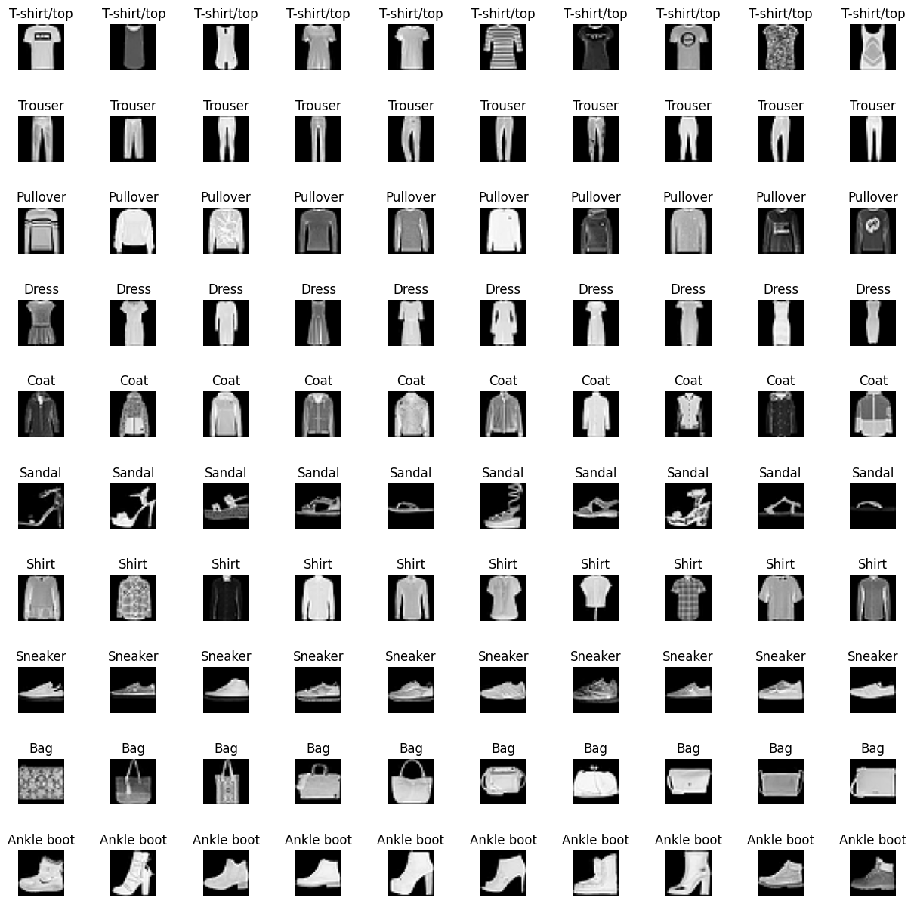
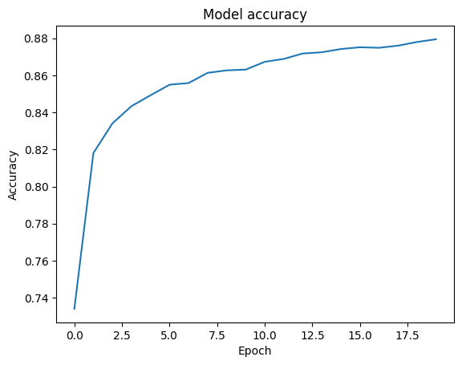
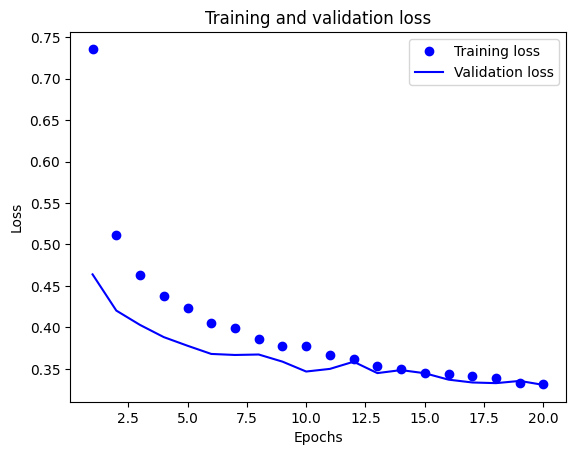
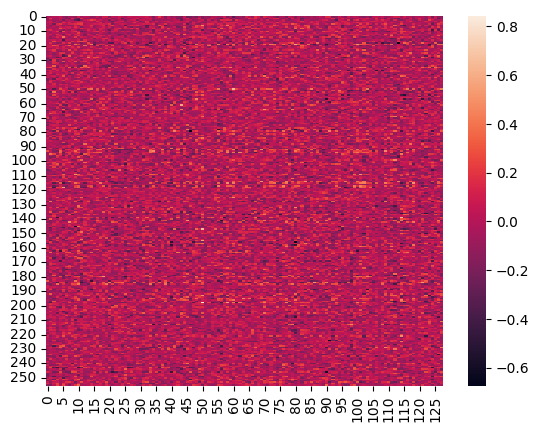

# Deep Learning Image Classification Neural Network
This project is to construct a deep forward neural network to solve an image classification problem. 

<!-- PROJECT SHIELDS -->
[![MIT License][license-shield]][license-url]
[![LinkedIn][linkedin-shield]][linkedin-url]

<!-- PROJECT Image -->
 

  

<!-- ABOUT THE PROJECT -->
## About The Project

In the era of digital revolution and data abundance, the demand for automated image analysis has surged across various domains, ranging from healthcare and surveillance to e-commerce and entertainment. At the heart of this revolution lies the concept of image classification neural networks, a sophisticated branch of artificial intelligence that enables machines to interpret and categorize visual data with remarkable accuracy.

An image classification neural network is a computational model inspired by the structure and function of the human brain, particularly the visual cortex. By leveraging layers of interconnected artificial neurons, these networks are trained on vast datasets of labeled images to learn intricate patterns and features representative of different object classes or categories. Through this process of learning, the network becomes adept at recognizing and classifying unseen images into predefined classes, enabling tasks such as identifying objects in photographs, detecting anomalies in medical scans, or recognizing faces in security footage.

In this project we will construct a deep forward neural network to solve an image classification problem. Detail included import dataset, setup the model and train the model, use the model to do classification and then analysis the result.

(<a href="#readme-top">back to top</a>)

### Built With

* Python 3.6
* Tensorflow 2.5
* Keras 2.12

(<a href="#readme-top">back to top</a>)

<!-- GETTING STARTED -->
## Getting Started

1. Setup your GPU running machine locally or on the cloud platform
2. Install IPython
3. Clone the git repository
4. Execute the ipython script file in the "code" folder

### Prerequisites

* Basic understanding of python
* Basic knowledge of running python script in IPython environment
* Basic knowledge of neural network structure

### Data Source

Keras fashion_mnist dataset

(<a href="#readme-top">back to top</a>)

<!-- Script Work Flow Description -->
## Script Work Flow Description

The script will execute below steps sequencially. 

1. Import libraries
2. Load the Fashion-MNIST dataset
3. Create a list of class names
4. Reshape training images and test images into 1D
5. Normalise training images and test images to float32 datatype
6. Encode trainning labels and test labels using one-hot encoding
7. Create model with 3 dense layers and 2 drop out layers
8. Setup optimizer, loss function and metrics for the model
9. Create model training log for TensorBoard
10. Model fitting
11. Evaluate the model by test dataset
12. Plot training accuracy values and training loss values

  

13. Check the training and validation loss

  

14. Check the model summary
15. Count the number of parameters
16. Check the number of activations
17. Plot the heatmap to review the initial weights of the model

  

18. Check the training using TensorBoard

(<a href="#readme-top">back to top</a>)

<!-- Key Concepts -->
## Key Concepts

### One-hot encoding

One-hot encoding is a technique used in machine learning and data preprocessing to represent categorical variables as binary vectors. In this encoding scheme, each category or class is represented by a binary vector where only one element is "hot" (or set to 1), while all other elements are "cold" (or set to 0).

### Dense layer

Also known as a fully connected layer, is a fundamental building block in artificial neural networks. It is characterized by each neuron in the layer being connected to every neuron in the preceding layer, forming a dense network of connections. In a dense layer, each neuron receives input from all the neurons in the previous layer and produces an output that contributes to the inputs of all neurons in the subsequent layer.

### Drop out layer 

A dropout layer is a regularization technique commonly used in neural networks, particularly in deep learning models, to prevent overfitting and improve generalization performance. The dropout layer randomly sets a fraction of the input units (neurons) to zero during training, effectively "dropping out" those units from the network for that particular iteration. This means that the information passing through the network is temporarily reduced, forcing the model to learn more robust and generalizable features.

### Loss function

Also known as a cost function or objective function, is a key component of training machine learning models, particularly in supervised learning tasks. It quantifies how well the model's predictions match the actual target values (ground truth) from the training data. The goal during training is to minimize this loss function, which essentially means reducing the discrepancy between the predicted outputs of the model and the true values.

### Model Fitting

The process of adjusting the parameters of a machine learning or statistical model to make it best approximate the patterns and relationships present in the training data. Essentially, it involves finding the optimal configuration of the model's parameters so that it can effectively capture the underlying structure of the data and make accurate predictions or classifications.

(<a href="#readme-top">back to top</a>)

<!-- Design Explanation -->
## Design Explanation

### The data type and shape of the images

The data type and shape of the images are unsigned integer number storing in 28 x 28 matrics, representing grayscale image in 28 × 28 pixel. Each pixel has a value between 0 and 255 where 0 represents black and 255 represents white.

### Preprocessing steps

1. Reshape the images into 1D NumPy arrays. This is because we will be using Dense layers to process the image which require 1D arrays.
2. Normalise the input data by converting the input to float32 datatype. It is the required format for the calculation in trainnnig model.
3. For the output we will encode it using one-hot encoding. One-hot encoding is a technique that categorical variables are represented as binary vectors, where each vector element corresponds to a unique category. The reason we use one-hot encoding is that it allows us to represent categorical variables in a way that is suitable for numerical computations.

### Output node in output layer

I am using 10 output nodes in my design. This is because the output data are in a 10-class structure. Each node in the output layer is representing an individual class of clothes that the model is trying to classify.

### Activation function in output layer

I am using the softmax activation function. It is because it can convert the output result vector into a vector of probabilities that sum up to one. The softmax function is differentiable, which is a requirement for using backpropagation. The gradients of the softmax function can be computed efficiently using the loss function, which measures the difference between the predicted and true class probabilities. In general, the softmax activation function is a common and popular choice for classification problems.

### Hidden layers

I am using 2 hidden layers in the model. Following the course's general guideline, I start with a simple model consisting of two dense layers. This is because adding more layers would increase the complexity of the model which may lead to overfitting when the dataset is small. Considering the training data is 60000 images which is not a very large dataset, 2 hidden layers is enough for getting a reasonably good result.

### Nodes in hidden layers

I am using 256 nodes for the first dense layer and 128 nodes for the second dense layer. Considering the dataset size is not very large, 256 nodes would be efficient enough to train the model in reasonably good performance. The node of the second dense layer is half of the first layer due to several reasons:

1. It helps reduce overfitting since when a model becomes too complex, it starts to fit the noise in the training data rather than the underlying patterns.
2. It helps reduce the computational cost of the model.

### Activation function in hidden layer

I have chosen the relu activation function for both hidden layers. What it does is sets negative values to zero and leaves positive values unchanged in all output of nodes. Relu is a simple and computationally efficient activation function and it is non-linear, which is very suitable for my model which does the classification calculation.

### Reshape the input

The input is reshaped to 1-dimensional vector to match the input shape expected by the dense layer. A dense layer requires its input to be a 1-dimensional vector.

### Loss function

I have used the categorical cross-entropy loss function. It is a loss function that is often used in multi-class classification problems. It measures the difference between the predicted probability distribution and the actual probability distribution for each class. It is commonly used when the predicted and actual values are categorical, for instance, in one-hot encoded vectors.

### Optimiser

I choose to use Adam as the optimization algorithm. It is an algorithm that combines momentum and RMSProp. It adapts the learning rate for each weight, but it uses a moving average of both the first and second moments of the gradients to calculate the adaptive learning rate. Adam can perform faster than other optimization algorithms in quite many cases.

### Training batch size

In my model I am using 128 as the training batch size. The batch size is to determine the number of images that will propagate through the network at once. For I have 60000 training images, setting training batch size to a very small number would increase the performance and training time of the model. Meanwhile the batch size should be small enough to fit into the memory of the GPU but large enough to take advantage of the parallelism running in the hardware. As a result I think 128 is the suitable batch size for this model fitting.

### The number of training epochs

I choose to use 20 training epochs in my model fitting. In general, the number of epochs is often in the range of 10 to 100, depending on the size of the dataset and the complexity of the model. Since my model is not very complicated and my training dataset is not considered to be very large, 20 epochs is suitable for my model fitting.

### Learning rate

Since the Adam optimization algorithm already incorporates momentum and an adaptive learning rate schedule, I did not set up a separate momentum or learning rate schedule for the model fitting.

### The number of trainable parameters

To estimate the total number of trainable parameters in the model, we need to calculate by the number of layers and the size of the layers. Since this model is only using dense layers which are fully connected, we can estimate the size of each layer with n input units and m output units has (n+1) x m trainable parameters, where the +1 is for the bias term.

The number of trainable parameters in each layer is:

* Input layer: 0 parameters
* First Hidden layer: (784 + 1) * 256 = 200,960 parameters
* Second Hidden layer: (256 + 1) * 128 = 32,896 parameters
* Output layer: (128 + 1) * 10 = 1,290 parameters
* Total trainable parameters = 200,960 + 32,896 + 1,290 = 235,146 parameters

### Memory used for training

#### Memory used for training:

* Size of input data: 60000 images x 784 pixels (28 x 28) = 47040000 bytes
* Size of trainable parameters = 235146 bytes

The size of the activation values in each layer will depend on the batch size used during training.

#### First hidden layer:

Input size: 128 x 784 = 100352 
Output size: 128 x 256 = 32768 
Size of activation values = 100352 + 32768 = 133120 bytes

#### Second hidden layer:
Input size: 128 x 256 = 32768 
Output size: 128 x 128 = 16384 
Size of activation values = 32768 + 16384 = 49152 bytes

#### Output layer:

Input size: 128 x 128 = 16384 
Output size: 128 x 10 = 1280 
Size of activation values = 16384 + 1280 = 17664 bytes

* Total size of activation values = 133120 + 49152 + 17664 = 199936 bytes

#### Total memory usage for training:

= Size of input data + Size of trainable parameters + Size of activation values 
= 47040000 bytes + 235146 bytes + 199936 bytes 
= 47475082 bytes

### Initialisation method

I am using the default initialisation method for training the model. In Keras, the default weight initialization method for dense layers is Glorot Uniform initialization. This method generate the initial value from Uniform distribution. Each layer has different max and min value of Uniform distribution depends on the number of input units and output units.

(<a href="#readme-top">back to top</a>)

<!-- LICENSE -->
## License

Distributed under the MIT License. See `LICENSE.txt` for more information.

(<a href="#readme-top">back to top</a>)

<!-- CONTACT -->
## Contact

Oscar Lee 
Email: mail.oscar.lee@gmail.com 
LinkedIn: [https://www.linkedin.com/in/oscarlee1](https://www.linkedin.com/in/oscarlee1) 

(<a href="#readme-top">back to top</a>)

<!-- MARKDOWN LINKS & IMAGES -->
[license-shield]: https://img.shields.io/github/license/othneildrew/Best-README-Template.svg?style=for-the-badge
[license-url]: LICENSE
[linkedin-shield]: https://img.shields.io/badge/-LinkedIn-black.svg?style=for-the-badge&logo=linkedin&colorB=555
[linkedin-url]: https://www.linkedin.com/in/oscarlee1
[Next.js]: https://img.shields.io/badge/next.js-000000?style=for-the-badge&logo=nextdotjs&logoColor=white
[Next-url]: https://nextjs.org/
[React.js]: https://img.shields.io/badge/React-20232A?style=for-the-badge&logo=react&logoColor=61DAFB
[React-url]: https://reactjs.org/
[Vue.js]: https://img.shields.io/badge/Vue.js-35495E?style=for-the-badge&logo=vuedotjs&logoColor=4FC08D
[Vue-url]: https://vuejs.org/
[Angular.io]: https://img.shields.io/badge/Angular-DD0031?style=for-the-badge&logo=angular&logoColor=white
[Angular-url]: https://angular.io/
[Svelte.dev]: https://img.shields.io/badge/Svelte-4A4A55?style=for-the-badge&logo=svelte&logoColor=FF3E00
[Svelte-url]: https://svelte.dev/
[Laravel.com]: https://img.shields.io/badge/Laravel-FF2D20?style=for-the-badge&logo=laravel&logoColor=white
[Laravel-url]: https://laravel.com
[Bootstrap.com]: https://img.shields.io/badge/Bootstrap-563D7C?style=for-the-badge&logo=bootstrap&logoColor=white
[Bootstrap-url]: https://getbootstrap.com
[JQuery.com]: https://img.shields.io/badge/jQuery-0769AD?style=for-the-badge&logo=jquery&logoColor=white
[JQuery-url]: https://jquery.com 

